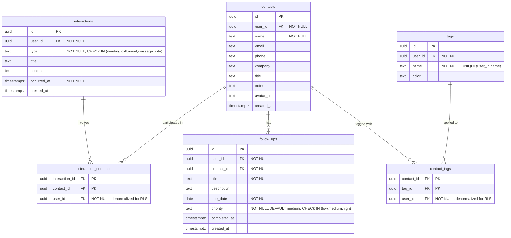

# Personal CRM MVP

## Enhancement Summary

**Deepened on:** 2026-02-19
**Reviewed on:** 2026-02-19 (DHH, Kieran TypeScript, Code Simplicity)
**Agents used:** architecture-strategist, security-sentinel, performance-oracle, kieran-typescript-reviewer, data-integrity-guardian, code-simplicity-reviewer, agent-native-reviewer, pattern-recognition-specialist, frontend-design skill, best-practices-researcher (RLS + NL search)

### Key Improvements
1. **Hardened schema** — junction table PKs, NOT NULL constraints, CHECK constraints on enums
2. **Type-safe NL search** — discriminated union types with `kind` field + Zod validation + runtime field allowlists
3. **Consolidated phases** — 8 phases reduced to 5 for faster time-to-value
4. **RLS security** — denormalized `user_id` on junction tables, INSERT triggers verify FK ownership
5. **Shared query functions** — reusable data access functions taking Supabase client as param (not a formal service layer)

### Simplifications Applied
- 10 migration files → 2 (schema + policies/indexes)
- Removed `relationship_strength` (manual field nobody maintains; compute staleness from interaction dates at query time)
- Removed `sentiment` column (no feature references it)
- Removed rate limiting (single-user app; Claude API has its own limits)
- Deferred `contact_connections` to v2 (capture in notes field for now)
- Removed `ai_cache` table for v1 (premature optimization for ~$0.10/month in API calls; use `React.cache()` per-request)
- Removed REST API — single-user app doesn't need `/api/v1/`; add when there's a real consumer
- Removed bearer token auth — no API consumers yet; cookie auth via Supabase is sufficient
- Removed soft deletes — hard delete + confirmation dialog is simpler; <1000 contacts don't need recoverability
- Removed `last_interaction` column + trigger — compute at query time with a subquery; avoids trigger complexity
- Removed `updated_at` triggers — set in application code when updating
- Removed `pg_trgm` + composite indexes — keep only `user_id` indexes for RLS; add others when slow
- Removed service worker for v1 — manifest only for installability; cache strategy adds complexity before there's content to cache
- Simplified typography to system font stack + one heading font (not three custom fonts)

---

## Overview

Build a mobile-friendly personal CRM as a PWA using Next.js App Router + Supabase + Claude API, deployed on Vercel. The app manages relationships, interactions, follow-ups, and tags, with AI-powered summaries, follow-up suggestions, conversation prep, and natural language search.

## Problem Statement

Maintaining relationships at scale is hard. Existing CRMs are built for sales teams, not personal relationship management. There's no good tool for remembering what you talked about with someone, who introduced whom, or who you should follow up with.

## Proposed Solution

A single-user PWA with:
- **Contacts** with tags
- **Interactions** (multi-contact) with a timeline view
- **Follow-ups** with due dates and priority
- **AI features** as a core part of the experience (summaries, suggestions, search)

## Technical Approach

### Architecture

```
┌──────────────────────────────────────────────────┐
│                    Vercel                          │
│  ┌──────────────────────────────────────────────┐ │
│  │           Next.js App Router                  │ │
│  │                                               │ │
│  │  Server Components ──▶ lib/queries/ (reads)  │ │
│  │  Server Actions    ──▶ Supabase (writes)     │ │
│  │  Route Handlers    ──▶ /api/ai/ (streaming)  │ │
│  │  Middleware         ──▶ Auth (cookie)         │ │
│  └──────────────────────────────────────────────┘ │
└──────────────────────────────────────────────────┘
         │                        │
         ▼                        ▼
┌─────────────────┐    ┌──────────────────┐
│    Supabase      │    │   Claude API      │
│  ┌────────────┐  │    │  (Anthropic)      │
│  │  Postgres   │  │    │                  │
│  │  Auth       │  │    │  Summaries       │
│  │  RLS        │  │    │  Follow-up ideas │
│  │  Storage    │  │    │  NL → Query      │
│  └────────────┘  │    │  Conversation     │
└─────────────────┘    │  prep             │
                       └──────────────────┘
```

**Key architectural principle:** Shared `lib/queries/` functions take a typed Supabase client as their first parameter. Server Components call them for reads; Server Actions call Supabase directly for writes. Route Handlers are only used for AI streaming (Server Actions cannot stream). No formal service layer — just plain functions.

### Stack

| Layer | Technology |
|-------|-----------|
| Framework | Next.js 15 (App Router, Server Components) |
| UI | shadcn/ui + Tailwind CSS |
| Validation | Zod (forms, AI responses, env vars) |
| Database | Supabase (Postgres) |
| Auth | Supabase Auth (email/password, invite-gated) |
| AI | Claude API via `@anthropic-ai/sdk` |
| Deployment | Vercel |
| Mobile | PWA (manifest.ts only for v1) |

### Data Model (ERD)



**Key schema decisions:**

- **Junction tables have `user_id`** — denormalized for fast RLS (simple `auth.uid() = user_id` instead of subquery joins). INSERT triggers verify FK ownership.
- **Junction tables have composite PKs** — `(interaction_id, contact_id)` and `(contact_id, tag_id)` prevent duplicates.
- **Hard delete on contacts** — with confirmation dialog showing cascade impact. <1000 contacts don't need soft delete recoverability.
- **No `updated_at`** — set in app code when updating, not via triggers. Fewer moving parts.
- **No `last_interaction`** — compute at query time with a subquery on `interaction_contacts`. Avoids trigger complexity.
- **NOT NULL on required fields** — name, type, occurred_at, due_date, priority. CHECK constraints on enum fields.
- **UNIQUE on `tags(user_id, name)`** — prevents duplicate tag names per user.
- **No `relationship_strength`** — deferred to v2. Compute staleness from interaction dates at query time.
- **No `sentiment`** — no feature references it. Add when there's a use case.
- **No `contact_connections`** — deferred to v2. Use the contact `notes` field for now. Can be added as a clean additive migration.
- **No `ai_cache`** — premature for single-user scale. Use `React.cache()` per-request and revisit if API costs become meaningful.

### RLS Strategy

Based on Supabase production best practices:

```sql
-- Direct ownership tables: simple equality check
-- CRITICAL: always wrap auth.uid() in SELECT for query planner optimization
CREATE POLICY "contacts_all" ON contacts
  FOR ALL TO authenticated
  USING ((SELECT auth.uid()) = user_id)
  WITH CHECK ((SELECT auth.uid()) = user_id);

-- Junction tables: direct check (user_id is denormalized)
CREATE POLICY "interaction_contacts_all" ON interaction_contacts
  FOR ALL TO authenticated
  USING ((SELECT auth.uid()) = user_id)
  WITH CHECK ((SELECT auth.uid()) = user_id);

-- Junction INSERT also validates FK ownership via trigger
```

**Security rules:**
- Always use `getUser()` on server, never `getSession()` (does not validate JWT signature)
- `cookies()` is async in Next.js 15 — `createClient()` must be `async`
- Supabase env transitioning from `ANON_KEY` to `PUBLISHABLE_KEY` (both work)
- Disable public signups in Supabase dashboard; gate via `ALLOWED_EMAIL` env var (validated by `lib/env.ts`)

### Type Safety Strategy

```typescript
// lib/env.ts — runtime env validation (loaded once at startup)
import { z } from 'zod';
const envSchema = z.object({
  NEXT_PUBLIC_SUPABASE_URL: z.string().url(),
  NEXT_PUBLIC_SUPABASE_ANON_KEY: z.string().min(1),
  ANTHROPIC_API_KEY: z.string().startsWith('sk-ant-'),
  ALLOWED_EMAIL: z.string().email(),
});
export const env = envSchema.parse(process.env);

// lib/types/database.ts — AUTO-GENERATED, never edit by hand
// Run: npx supabase gen types typescript --project-id "$PROJECT_ID" > lib/types/database.ts

// lib/types/models.ts — derived helper types
import type { Database } from './database';
type Tables = Database['public']['Tables'];
export type Contact = Tables['contacts']['Row'];
export type ContactInsert = Tables['contacts']['Insert'];
export type ContactUpdate = Tables['contacts']['Update'];
// ... same for all tables

// lib/types/actions.ts — shared return type for all server actions
type ActionSuccess<T = void> = { status: 'success'; data: T };
type ActionError = { status: 'error'; message: string; fieldErrors?: Record<string, string[]> };
export type ActionResult<T = void> = ActionSuccess<T> | ActionError;

// lib/types/enums.ts — enum values as const arrays (runtime + type)
export const INTERACTION_TYPES = ['meeting', 'call', 'email', 'message', 'note'] as const;
export type InteractionType = typeof INTERACTION_TYPES[number];
export const PRIORITIES = ['low', 'medium', 'high'] as const;
export type Priority = typeof PRIORITIES[number];
```

**All Supabase clients must be typed:** `createServerClient<Database>(...)` and `createBrowserClient<Database>(...)`.

### Implementation Phases

#### Phase 1: Scaffold + Auth + Schema

Set up the project, auth, and entire database schema in one phase.

**Files to create:**

**Project setup:**
- `package.json` — next, @supabase/ssr, @supabase/supabase-js, @anthropic-ai/sdk, tailwindcss, zod
- `next.config.ts` — security headers (CSP, X-Frame-Options)
- `tailwind.config.ts` — shadcn/ui theme (warm editorial palette: terracotta primary, amber AI accent)
- `tsconfig.json` — strict, noUncheckedIndexedAccess, exactOptionalPropertyTypes, path aliases
- `.env.local` — NEXT_PUBLIC_SUPABASE_URL, NEXT_PUBLIC_SUPABASE_ANON_KEY, ANTHROPIC_API_KEY, ALLOWED_EMAIL
- `.gitignore` — node_modules, .next, .env*.local, .DS_Store

**Supabase clients:**
- `lib/supabase/client.ts` — browser client (`createBrowserClient<Database>`)
- `lib/supabase/server.ts` — async server client (`createServerClient<Database>` + `await cookies()`)
- `lib/supabase/middleware.ts` — middleware client (token refresh + session sync)

**Auth:**
- `middleware.ts` — auth check via `getUser()`, redirect to /login, gate signup to ALLOWED_EMAIL
- `app/(auth)/login/page.tsx` — email/password login form
- `app/(auth)/signup/page.tsx` — gated signup (checks ALLOWED_EMAIL)
- `app/(auth)/auth/callback/route.ts` — Supabase auth callback handler
- `app/layout.tsx` — root layout with Tailwind, metadata

**Database migrations:**
- `supabase/migrations/001_schema.sql` — all 6 tables, constraints, CHECK enums
- `supabase/migrations/002_rls_indexes.sql` — RLS policies, FK ownership validation triggers, `user_id` indexes

**Types & Validation:**
- `lib/env.ts` — Zod-validated env vars (loaded once at startup)
- `lib/types/database.ts` — auto-generated (`npx supabase gen types typescript`)
- `lib/types/models.ts` — derived Row/Insert/Update types
- `lib/types/actions.ts` — `ActionResult<T>` discriminated union
- `lib/types/enums.ts` — `as const` arrays for interaction types, priorities

**Acceptance criteria:**
- [ ] `npm run dev` starts without errors
- [ ] `lib/env.ts` validates env vars at startup (missing vars = immediate crash with clear message)
- [ ] Login/signup works with Supabase auth
- [ ] Only the configured email can register (Supabase dashboard disables public signup)
- [ ] Unauthenticated users redirected to /login
- [ ] Session refresh works via middleware
- [ ] All 6 tables created with correct constraints and NOT NULLs
- [ ] RLS enabled on all tables with per-operation policies
- [ ] `user_id` indexes on all tables for RLS performance
- [ ] FK ownership validation triggers on junction table INSERTs
- [ ] Migrations run cleanly on a fresh Supabase project
- [ ] `supabase gen types` produces correct TypeScript output

**Key indexes to define:**
```sql
-- RLS performance (one per table with user_id)
CREATE INDEX idx_contacts_user_id ON contacts(user_id);
CREATE INDEX idx_interactions_user_id ON interactions(user_id);
CREATE INDEX idx_follow_ups_user_id ON follow_ups(user_id);
CREATE INDEX idx_tags_user_id ON tags(user_id);
```

Add more indexes later only when queries are measurably slow. With <1000 rows, Postgres sequential scans are fast enough.

#### Phase 2: Core CRUD — Contacts, Interactions, Follow-ups, Tags

The essential CRM loop. All entities in one phase because they are tightly coupled.

**Shared query functions (plain functions, Supabase client as first param):**
- `lib/queries/contacts.ts` — getContacts, getContactById, getContactWithDetails
- `lib/queries/interactions.ts` — getInteractions, getInteractionsByContact
- `lib/queries/follow-ups.ts` — getFollowUps, getDueFollowUps
- `lib/queries/tags.ts` — getTags, getTagsByContact
- `lib/queries/dashboard.ts` — getOverdueFollowUps, getRecentInteractions, getNeedsAttention

**Server Actions (mutations, call Supabase directly):**
- `app/(app)/contacts/actions.ts` — createContact, updateContact, deleteContact
- `app/(app)/interactions/actions.ts` — createInteraction, updateInteraction, deleteInteraction
- `app/(app)/follow-ups/actions.ts` — createFollowUp, completeFollowUp, updateFollowUp, deleteFollowUp
- `lib/actions/tags.ts` — createTag, deleteTag, assignTag, removeTag (not in a route segment; tags have no dedicated page)

**Pages:**
- `app/(app)/layout.tsx` — authenticated layout with navigation
- `app/(app)/page.tsx` — dashboard (overdue follow-ups, recent interactions, needs-attention)
- `app/(app)/contacts/page.tsx` — contact list (server component, searchable)
- `app/(app)/contacts/[id]/page.tsx` — contact detail (profile + interactions + follow-ups + tags)
- `app/(app)/contacts/new/page.tsx` — create contact form
- `app/(app)/contacts/[id]/edit/page.tsx` — edit contact form
- `app/(app)/interactions/page.tsx` — chronological feed, filterable by type/date
- `app/(app)/follow-ups/page.tsx` — follow-up list (overdue highlighted)

**Components:**
- `components/contacts/contact-card.tsx` — list item (server component, static display)
- `components/contacts/contact-form.tsx` — reusable form with discriminated union props (`mode: 'create' | 'edit'`)
- `components/interactions/interaction-form.tsx` — multi-contact selector, type picker (segmented control), content editor
- `components/interactions/interaction-card.tsx` — timeline item
- `components/follow-ups/follow-up-card.tsx` — list item with complete/snooze (use `useOptimistic` for instant feedback)
- `components/follow-ups/follow-up-form.tsx` — create/edit form
- `components/tags/tag-picker.tsx` — multi-select tag assignment
- `components/tags/tag-badge.tsx` — colored tag display
- `components/dashboard/overdue-follow-ups.tsx`
- `components/dashboard/recent-interactions.tsx`
- `components/dashboard/needs-attention.tsx`
- `components/layout/sidebar.tsx` — desktop nav
- `components/layout/bottom-tabs.tsx` — mobile nav (4 tabs: Dashboard, Contacts, Interactions, Follow-ups)
- `components/layout/header.tsx` — top bar with search and user menu
- `components/shared/empty-state.tsx` — welcoming first-time user experience
- `components/shared/confirm-dialog.tsx` — deletion confirmation with cascade impact
- `components/ui/` — shadcn/ui components

**Acceptance criteria:**
- [ ] Create contact with name (required) + optional fields; Zod validation on both client and server
- [ ] List contacts with search by name/company (ILIKE, no pg_trgm needed at this scale)
- [ ] View contact detail with all related data (Supabase nested select or `Promise.all`)
- [ ] Edit contact fields
- [ ] Delete contact with confirmation dialog showing cascade impact (hard delete)
- [ ] Empty states for all pages
- [ ] Mobile-responsive layout with bottom tabs and sidebar
- [ ] Log interaction with type, title, content, occurred_at, and 1+ contacts
- [ ] View interaction timeline (all contacts or scoped to one)
- [ ] Edit/delete interactions
- [ ] Create follow-up with title, due date, priority
- [ ] Complete follow-up (sets completed_at) with optimistic UI
- [ ] Snooze follow-up (change due_date) via bottom sheet with quick-pick options
- [ ] Overdue follow-ups visually distinct (terracotta accent)
- [ ] Filter interactions by type and date range
- [ ] Create tags with name and color; unique per user
- [ ] Assign/remove tags on contacts; filter contact list by tag
- [ ] Dashboard renders three sections with real data
- [ ] `revalidatePath` called in all server actions for data freshness
- [ ] Consistent `ActionResult<T>` return type across all server actions

#### Phase 3: AI Features

Claude API integration for summaries, follow-up suggestions, conversation prep, and NL search.

**Files to create:**

- `lib/ai/client.ts` — Anthropic SDK client with retry config (maxRetries: 2)
- `lib/ai/prompts.ts` — system prompts (include schema definition for NL search, auto-generated from types)
- `lib/types/search.ts` — discriminated union filter types + Zod schemas for NL search
- `lib/types/ai.ts` — typed response shapes for each AI feature + Zod schemas
- `app/api/ai/summarize/route.ts` — streaming summary
- `app/api/ai/suggest-followups/route.ts` — structured JSON suggestions
- `app/api/ai/conversation-prep/route.ts` — streaming briefing
- `app/api/ai/search/route.ts` — NL query → validated structured filter → Supabase query → JSON results
- `components/ai/ai-summary.tsx` — streaming display (`'use client'`)
- `components/ai/ai-suggestions.tsx` — follow-up suggestion cards with "Create" button
- `components/ai/conversation-prep.tsx` — briefing display (`'use client'`)
- `components/ai/natural-language-search.tsx` — search input with results

**NL search architecture (critical — highest-risk feature):**

```typescript
// lib/types/search.ts

// CRITICAL: Use `as const` arrays for runtime validation, not type-only unions
export const CONTACT_FIELDS = ['name', 'email', 'company', 'title'] as const;
export const DATE_FIELDS = ['occurred_at', 'created_at', 'due_date'] as const;

// Zod schemas with runtime field allowlists
const textFilterSchema = z.object({
  kind: z.literal('text'),  // discriminant — must be disjoint across filter types
  field: z.enum(CONTACT_FIELDS),
  operator: z.enum(['eq', 'ilike', 'neq']),
  value: z.string(),
});

const dateFilterSchema = z.object({
  kind: z.literal('date'),  // discriminant — disjoint from 'text'
  field: z.enum(DATE_FIELDS),
  operator: z.enum(['gte', 'lte', 'eq']),
  value: z.string(),  // ISO 8601 date
});

export const searchFilterSchema = z.discriminatedUnion('kind', [textFilterSchema, dateFilterSchema]);
export type SearchFilter = z.infer<typeof searchFilterSchema>;
```

**Simplicity rules for NL search:**
- One model (Sonnet), one prompt, Zod validation on the output. No template matching, no model routing.
- Prompt caching via `cache_control: { type: "ephemeral" }` on system prompt for cost reduction.

**AI context limits:**
- Summaries: last 50 interactions, max 2000 chars per interaction, max 50K total chars
- Conversation prep: last 5 interactions, open follow-ups, tags, contact metadata
- Follow-up suggestions: interaction frequency analysis, last 20 interactions

**Acceptance criteria:**
- [ ] Summarize interaction history for a contact (streaming)
- [ ] Suggest follow-ups with structured JSON (title, due_date, priority, contact_id, reasoning)
- [ ] Generate conversation prep briefing (streaming)
- [ ] NL search returns relevant contacts/interactions as JSON via validated filters
- [ ] NL search field/operator allowlist rejects invalid Claude output
- [ ] Zod validation on all AI responses before use
- [ ] Graceful error handling when Claude API is unavailable (error state + retry button)
- [ ] All non-AI features work independently when AI is down

#### Phase 4: PWA Manifest & Deployment

Make the app installable and deploy to Vercel.

**Files to create:**

- `app/manifest.ts` — PWA manifest (name, icons, theme_color, display: standalone)
- `public/icons/` — PWA icons (192x192, 512x512)

No service worker for v1. The manifest alone enables "Add to Home Screen" on most platforms. Add a service worker later when there's a clear caching strategy worth the complexity.

**Acceptance criteria:**
- [ ] App installable on iOS and Android via "Add to Home Screen"
- [ ] Standalone mode (no browser chrome)
- [ ] Deployed to Vercel with environment variables configured
- [ ] Vercel and Supabase in same region (us-east-1) for minimal latency
- [ ] HTTPS enforced

#### Phase 5: Polish & Iterate

Iterate on design and UX based on actual usage.

- Tune the warm editorial design palette (terracotta primary, amber AI accent)
- Add loading skeletons and staggered animations (`motion` library)
- Add `useOptimistic` for high-frequency actions
- Test on real mobile devices
- Iterate on AI prompts based on actual quality

---

## Alternative Approaches Considered

| Approach | Why Rejected |
|----------|-------------|
| Neo4j for relationship graph | Overkill for personal-scale data. Postgres junction tables sufficient. |
| pgvector for semantic search | Added complexity without clear benefit at this scale. Claude can generate structured queries from natural language. |
| Single-contact interactions | Real meetings involve multiple people. Multi-contact from the start avoids painful schema migration later. |
| No auth | Data is personal and sensitive. Even a single-user app needs auth to protect against unauthorized access. |
| Native mobile app | PWA gives 90% of the mobile experience with 10% of the effort. React Native or Flutter would double the codebase. |
| ai_cache table | Premature optimization. Single-user makes ~5-10 AI calls/day at ~$0.10/month. Add caching if costs become real. |
| 10 migration files | No deployed DB to migrate from. One schema file + one policies file is cleaner for greenfield. |
| Cursor-based pagination | Personal CRM will have <1000 contacts. Load all and filter client-side; add pagination if needed later. |
| REST API (`/api/v1/`) | No consumers yet. Single-user app accessed via browser. Add when there's a real agent or automation need. |
| Bearer token auth | No API to authenticate. Cookie auth via Supabase is sufficient for the web app. |
| Soft deletes | Added complexity (filter `WHERE deleted_at IS NULL` everywhere) for <1000 contacts. Hard delete + confirmation dialog is simpler. |
| Service layer abstraction | Formal service classes add indirection without benefit at this scale. Plain query functions taking Supabase client as param are sufficient. |
| `pg_trgm` search indexes | ILIKE works fine for <1000 rows. Add trigram indexes only if search is measurably slow. |
| `last_interaction` column + trigger | Avoids trigger complexity. Compute at query time with a subquery — fast enough at this scale. |
| Three custom fonts | System font stack + one heading font reduces page weight and avoids FOIT. |

## Success Metrics

- App loads in < 2s on mobile (LCP)
- Contact creation takes < 10 seconds
- AI summary generates in < 5 seconds (streaming)
- Follow-up reminders visible on dashboard within 24h of creation
- Zero data leaks (RLS covers all tables, RLS tests in CI)

## Dependencies & Prerequisites

- Supabase project created (free tier, us-east-1 region)
- Vercel account (free tier, us-east-1 region)
- Anthropic API key
- Node.js 20+

## Risk Analysis & Mitigation

| Risk | Mitigation |
|------|-----------|
| Claude API costs | Truncate AI context (50K char cap), prompt caching, add response caching only if costs exceed $5/month |
| Supabase free tier limits | Monitor usage, use PostgREST (not direct connections) from Vercel serverless |
| Next.js 30s proxy timeout | Use streaming for all AI endpoints, never proxy through rewrites |
| Schema changes after launch | Multi-contact interactions designed from the start, junction tables with composite PKs |
| NL search injection | Runtime field allowlists (`as const` arrays + `z.enum()`), `kind` discriminant for filter types, Zod validation on all Claude output |
| Junction table RLS performance | Denormalized user_id with simple equality check instead of subquery joins |
| Contact detail N+1 queries | Use Supabase nested select or `Promise.all()` to parallelize, never sequential queries |

## Future Considerations (v2+)

- REST API (`/api/v1/`) when there's a real agent or automation consumer
- Service worker with cache-first strategy for static assets
- Soft deletes if users request undo/recoverability
- Contact connections (relationship graph with directional types)
- CSV/vCard import for initial data seeding
- Push notifications for follow-up reminders
- Auto-calculated relationship strength based on interaction frequency
- Visual relationship graph (D3 force-directed)
- Data export (CSV, JSON)
- Calendar integration (Google Calendar, Apple Calendar)
- Email integration (parse emails into interactions)
- AI response caching (ai_cache table with TTL + invalidation)
- Supabase Realtime subscriptions for live UI updates
- `pg_trgm` indexes and composite dashboard indexes when data scale demands it

## Design Direction

**Aesthetic: "Warm Editorial"** — premium personal notebook feel, not enterprise SaaS.

- **Typography**: System font stack (body) + one serif heading font (e.g., Instrument Serif via Google Fonts)
- **Colors**: Warm paper palette, terracotta primary (`hsl(16, 55%, 48%)`), amber accent for AI features
- **Mobile**: 44px touch targets, safe area handling, bottom sheets for modals, swipe gestures
- **Motion**: Staggered list reveals, AnimatePresence for transitions, shared layout animations (all <400ms)
- **Empty states**: Welcoming first-person copy, composed icon scenes, single CTA

## References & Research

### Internal
- Brainstorm: `docs/brainstorms/2026-02-19-personal-crm-tech-stack-brainstorm.md`

### External
- [Supabase + Next.js SSR docs](https://supabase.com/docs/guides/auth/server-side/nextjs)
- [Supabase RLS guide](https://supabase.com/docs/guides/database/postgres/row-level-security)
- [Supabase RLS performance tips](https://supabase.com/docs/guides/troubleshooting/rls-performance-and-best-practices-Z5Jjwv)
- [Next.js PWA guide](https://nextjs.org/docs/app/guides/progressive-web-apps)
- [Anthropic TypeScript SDK](https://github.com/anthropics/anthropic-sdk-typescript)
- [Anthropic Streaming docs](https://docs.anthropic.com/en/api/messages-streaming)
- [supabase-test-helpers for RLS testing](https://github.com/usebasejump/supabase-test-helpers)

### Key Technical Rules
- Always use `getUser()` on server, never `getSession()` (does not validate JWT)
- `cookies()` is async in Next.js 15 — all Supabase server client creation must be `async`
- Wrap `auth.uid()` in `(SELECT ...)` in RLS policies for query planner optimization
- Use PostgREST (default for @supabase/ssr) from Vercel, never direct Postgres connections
- For Claude streaming, use Route Handlers (Server Actions cannot stream)
- Truncate AI context: 2000 chars per interaction, 50K total
